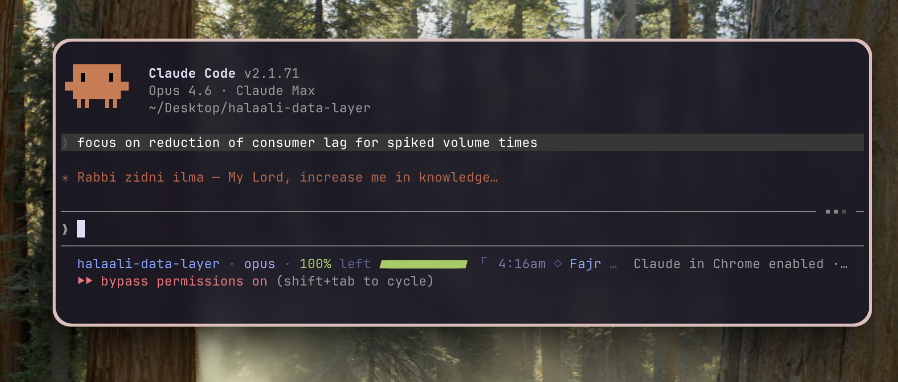

# claude-dhikr

Replace Claude Code's thinking spinner with dhikr (remembrance of Allah). Optionally add prayer times to your statusline.



While Claude thinks, instead of "Pondering..." or "Cogitating...", you see SubhanAllah, Alhamdulillah, Rabbi zidni ilma. The statusline shows a countdown to the next prayer alongside your project context, with the diamond changing color as the prayer approaches.

## Install

Paste this into Claude Code:

```
Clone https://github.com/moizibnyousaf/claude-dhikr, then read SETUP.md and follow it to set me up.
```

Claude will ask what you want (spinner, statusline, or both), your city, and your school. It figures out coordinates and calculation method from the city name, then installs everything.

Or install manually:

```bash
git clone https://github.com/moizibnyousaf/claude-dhikr
cd claude-dhikr
node bin/claude-dhikr.js
```

On first run, you'll be asked for your coordinates and calculation method. Restart Claude Code to see the changes.

## Commands

```
claude-dhikr              install everything (setup wizard on first run)
claude-dhikr spinner      install dhikr spinner only
claude-dhikr statusline   install prayer statusline only
claude-dhikr setup        reconfigure location and calculation method
claude-dhikr shuffle      re-shuffle the dhikr order
claude-dhikr uninstall    remove everything, restore defaults
```

## The adhkar

Seven reminders cycle through the spinner:

| Dhikr | Meaning | Source |
|---|---|---|
| SubhanAllah | Glory be to Allah | Sahih Muslim 2137 |
| Alhamdulillah | All praise is for Allah | Sahih Muslim 2137 |
| Allahu Akbar | Allah is the Greatest | Sahih Muslim 2137 |
| La ilaha illAllah | There is no god but Allah | Sahih Muslim 2137 |
| La hawla wa la quwwata illa billah | There is no power except with Allah | Bukhari 4205 |
| Ask Allah for beneficial knowledge | Morning dua | Ibn Majah 925 |
| Rabbi zidni ilma | My Lord, increase me in knowledge | Quran 20:114 |

The first four are the most beloved words to Allah (Sahih Muslim 2137). "La hawla wa la quwwata illa billah" is described as a treasure of Jannah (Sahih al-Bukhari 4205). "Rabbi zidni ilma" is from Surah Taha 20:114.

## How it works

Claude Code reads `spinnerVerbs` from `~/.claude/settings.json`. This tool writes the dhikr list there. No hooks, no background processes.

The statusline is a bash script at `~/.claude/claude-dhikr-statusline.sh`. It receives Claude's session JSON on stdin and outputs ANSI text. Prayer times are fetched once daily from the [Aladhan API](https://aladhan.com/prayer-times-api) and cached at `~/.cache/prayer-times/`. The statusline also shows your directory, git branch, model, context usage, and session cost.

## Configuration

Location and calculation method are stored at `~/.claude-muslim/config.json`:

```json
{
  "latitude": 43.6532,
  "longitude": -79.3832,
  "method": 2,
  "school": 1,
  "city": "Toronto"
}
```

Run `claude-dhikr setup` to change these.

Calculation methods: Karachi (1), ISNA (2), MWL (3), Umm Al-Qura (4), Egyptian (5), and others from the Aladhan API. School: 0 for Shafi'i/Hanbali/Maliki, 1 for Hanafi.

## Requirements

- Node.js 18+ (no `npm install` needed; there are zero runtime dependencies)
- Claude Code
- `jq` and `curl` (statusline only; the spinner works without them)

## License

MIT
